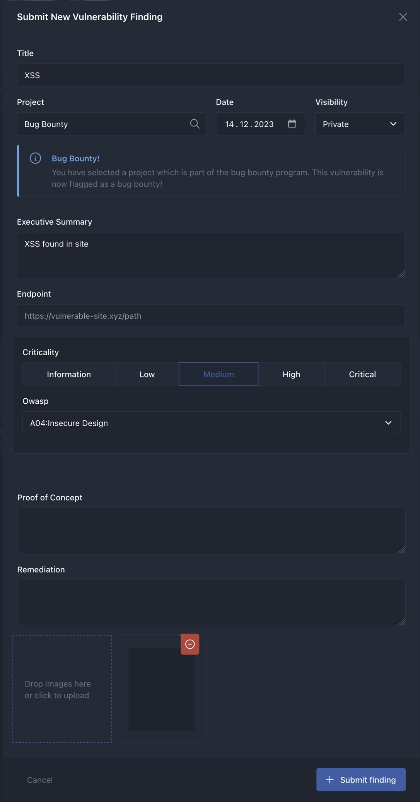
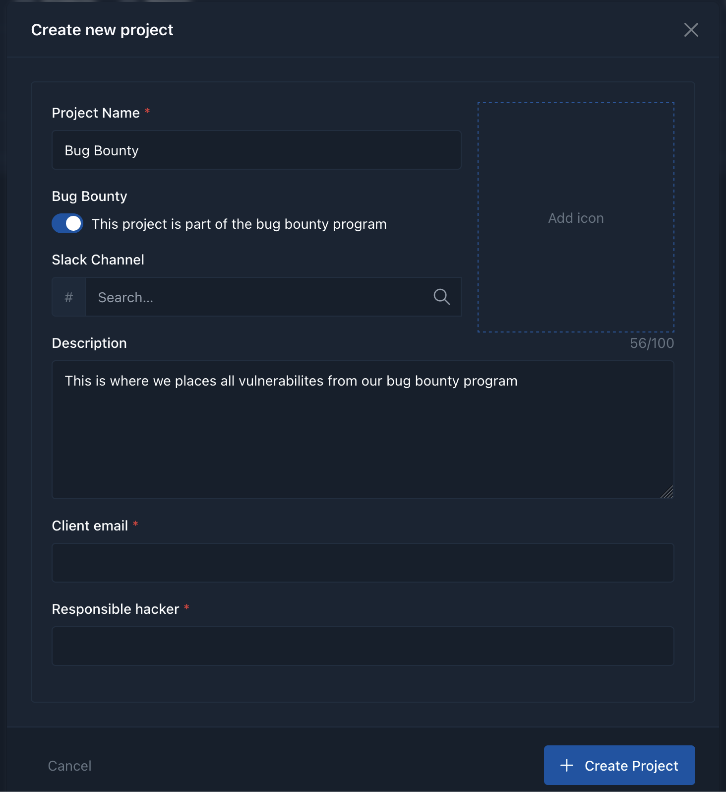

# 🛡️💾 PRISM Pentest Report Information Security Management 🚀

Welcome to PRISM (Pentest Report Information Security Management) – the ultimate command center for tech wizards and cyber sentinels! 🧙‍♂️🔍 Dive into a world where managing and decoding pentesting reports becomes a quest of efficiency and top-notch security. 🌐🔐

## 📸 Screenshots: A Sneak Peek into the Matrix

<div>
  <table>
    <tr>
      <td></td>
      <td></td>
    </tr>
    <tr>
      <td></td>
      <td></td>
    </tr>
    <tr>
      <td></td>
      <td></td>
    </tr>
    <tr>
      <td></td>
      <td></td>
    </tr>
  </table>
</div>

## 🌌 Overview: Where Technology Meets Security

PRISM is a meticulously crafted toolkit designed for the guardians of the digital realm - security engineers and pentesters. It's composed of:

1. **API**: Engineered with GoLang for blistering speed and unwavering reliability. 🚀
2. **Web Interface**: Crafted using SvelteKit for an immersive and interactive experience. 🖥️

## 🗂️ Folder Structure: The Architect's Blueprint

PRISM's repository is organized in a manner that would make even the most organized minds swoon:

- 📂 `.cluster`: Home to Helm charts for orchestrating Kubernetes deployments.
- 📂 `.git`: The heart of Git version control.
- 📂 `.gitignore`: The keeper of secrets, specifying what to ignore.
- 📂 `.gitlab`: GitLab CI/CD scrolls and incantations.
- 📂 `api`: The cerebral cortex of the API component.
- 📂 `web`: The digital canvas for the Web interface.

## 🚀 Getting Started: Launch Instructions

### Prerequisites

- A cauldron of GoLang brew for the API.
- A pinch of Node.js and a dash of Bun (or npm) for the web interface.

### Conjuring the API

Step into the `api` sanctum:

```bash
cd api
```

Summon the API with the ancient Go runes:

```bash
SLACK_PATH="tmp/slackMessage.json" GO_END=dev go run *.go
```

### Weaving the Web Interface

Navigate to the mystical lands of web:

```bash
cd web
```

Bring forth the web interface with Bun's magic (or npm's charm):

```bash
bun run dev -- --host 0.0.0.0

# or

npm run dev -- --host 0.0.0.0
```

## 🤝 Contributing: Join the Fellowship

Adventurers and scholars, unite! Contributions to PRISM are more than welcome. Consult our CONTRIBUTING.md for the sacred code of conduct and mystical pull request rituals.


## 🛡️ Security: The Fortress Walls

In the realm of security, we are ever-vigilant. Encounter any dark sorcery or security-related issues? Send a raven to the maintainers or report in the issues section.

## 📜 License: The Covenant

Shared across the lands under the MIT License. Peruse LICENSE for the ancient texts.

---

Embark on your quest for cybersecurity greatness! 🔐🌟
